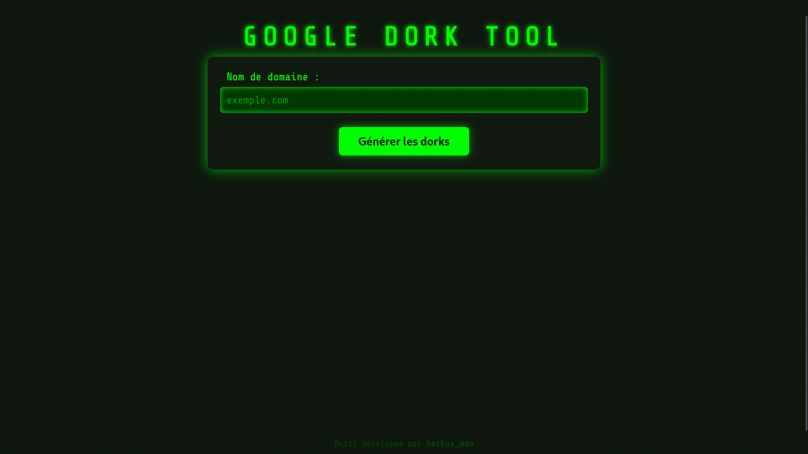

# 🔍 Google Dork Tool

Un outil web simple et efficace pour générer automatiquement des **requêtes Google Dorks** ciblées. Il permet d’identifier facilement des **fichiers sensibles exposés**, **répertoires ouverts**, **panneaux d’administration**, **failles potentielles** et bien plus, classés par catégories.

> ⚠️ **Usage légal uniquement !** Cet outil est conçu pour des tests de sécurité autorisés et à des fins pédagogiques. Ne l’utilisez jamais sans permission explicite.

---
## 🖼️ Aperçu de l'outil

Voici une capture d'écran de l'interface :



## 🚀 Fonctionnalités principales

- 📂 Catégories de dorks préformatées :
  - Répertoires ouverts
  - Fichiers exposés (`.pdf`, `.sql`, `.env`, etc.)
  - Vulnérabilités SQL Injection
  - Panneaux d’administration
  - Fichiers de configuration sensibles
  - Technologies vulnérables (WordPress, Joomla, etc.)
- 💻 Interface web intuitive et responsive avec affichage clair des résultats
- 🔒 Message d’avertissement sur l’utilisation légale intégré à l’interface

---

## 🛠️ Installation rapide

### 1. Cloner ce dépôt

```bash
git clone https://github.com/hackusman/google_dork_tool.git
cd google_dork_tool
````

### 2. Installer les dépendances Python

```bash
pip install -r requirements.txt
```

*Veillez à avoir Python 3.7 ou supérieur.*

### 3. Lancer l’application

```bash
python app.py
```

Puis ouvrez votre navigateur à l’adresse :

```
http://localhost:5000
```

---

## 📁 Structure du projet

```
.
├── app.py                   # Application Flask principale
├── templates/
│   └── index.html           # Template HTML pour l’interface utilisateur
├── requirements.txt         # Dépendances Python du projet
└── README.md                # Documentation du projet (ce fichier)
```

---

## 📝 Utilisation

* Saisissez un nom de domaine ciblé (exemple : `exemple.com`)
* Cliquez sur **Générer les Dorks**
* Consultez les requêtes Google dorks générées, prêtes à être utilisées

---

## ⚠️ Avertissement légal

Cet outil est destiné uniquement à un usage :

* **Légal**,
* Pour des **tests de sécurité autorisés**,
* Et à des fins **éducatives**.

L’auteur décline toute responsabilité en cas d’usage malveillant ou non autorisé.

---

## 🧑‍💻 Auteur

Développé avec passion par **hackus\_man**

---

*Merci de respecter les bonnes pratiques éthiques en cybersécurité !*
